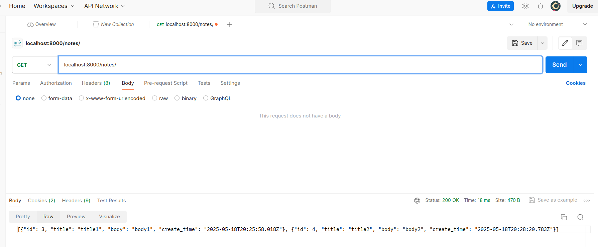

# گزارش آزمایش ۶: آشنایی با داکر

در این گزارش قصد داریم تا با استفاده از داکر، دو سرویس back-end و database خود را ایجاد کرده و ارتباط آنها را به نوع درستی تنظیم نماییم.


## ایجاد Back-end Image
ابتدا با ایجاد یک فایل `Dockerfile` و قرار دادن دستورات مربوط به دانلود `dependency`ها و نحوه نصب و راه‌اندازی بسته‌ها آغاز می‌کنیم:

```dockerfile
FROM docker.arvancloud.ir/python:3.10

WORKDIR /src

COPY requirements.txt .
RUN pip install -r requirements.txt

COPY . /src
RUN chmod +x /src/wait-for-it.sh
RUN chmod +x /src/entrypoint.sh

EXPOSE 8000
```


در ابتدا از مخزن آروان نسخه `python:3.10` را دانلود می‌کنیم. 

```dockerfile
FROM docker.arvancloud.ir/python:3.10
```

سپس فایل مربوط به `dependency`های لازم یعنی `requirement.txt` را کپی کرده و سپس با استفاده از دستورات `pip` آن‌ها را دانلود نصب می‌کنیم.


```dockerfile
COPY requirements.txt .
RUN pip install -r requirements.txt
```

حال کافی است تا محتویات کد را کپی کرده و همچنین اجازه‌ی اجرای اسکریپت‌های لازم در مراحل بعد را نیز فراهم سازیم.

```dockerfile
COPY . /src
RUN chmod +x /src/wait-for-it.sh
RUN chmod +x /src/entrypoint.sh
```


در انتها پورتی که قرار است `container` ایحاد شده از این `image` از آن استفاده کند را نیز مشخص می‌کنیم.


```dockerfile
EXPOSE 8000
```


## راه‌اندازی postgres

در این قسمت لازم است تا تغییراتی در فایل `setting.py` اعمال کنیم تا بجای استفاده از `sqlite` از سرویس 
`postgres` در آدرس مدنظر ما استفاده کند.
برای اینکار تنظیمات زیر را انجام می‌دهیم:

```python
DATABASES = {
    'default': {
        'ENGINE': 'django.db.backends.postgresql',
        'NAME': os.getenv('DB_NAME', 'postgres'),
        'USER': os.getenv('DB_USER', 'postgres'),
        'PASSWORD': os.getenv('DB_PASSWORD', 'postgres'),
        'HOST': os.getenv('DB_HOST', 'db'),
        'PORT': os.getenv('DB_PORT', '5432'),
    }
}
```
همانطور که مشاهده می‌کنید از سرویس `postgresql` در قسمت `Engine` استفاده شده است. همچنین علاوه بر اطلاعات `client`، آدرس سرویس پایگاه داده نیز با استفاده از 
`HOST` و `PORT` آورده شده است.

لازم به ذکر است که برای استفاده از این پایگاه داده نیاز است تا از کتابخانه‌ی `psycopg` استفاده شود که در این قسمت به فایل `requirements.txt` اضافه شده است.

## ایجاد docker-compose

حال که نحوه ساخت سرویس `backend` و نحوه ارتباط آن با پایگاه داده مشخص شده است کافی است تا فایل `docker-compose`زیر را برای بالا آورد سرویس‌‌ها ایجاد کنیم.

```yaml
version: '3.9'
services:
  backend:
    build: .
    container_name: backend_container
    ports:
      - '8000:8000'
    depends_on:
      - db
    environment:
      DB_NAME: postgres            
      DB_USER: postgres            
      DB_PASSWORD: postgres        
      DB_HOST: db                  
      DB_PORT: 5432               
    volumes:
      - .:/src
    command: ["sh", "/src/entrypoint.sh"]

  db:
    image: postgres
    container_name: database_container
    ports:
      - '5432:5432'
    environment:
      POSTGRES_DB: postgres
      POSTGRES_USER: postgres
      POSTGRES_PASSWORD: postgres
    volumes:
      - postgres_data:/var/lib/postgresql/data

volumes:
  postgres_data:
```

همانطور که مشاهده می‌کنید دو سرویس ایجاد شده است.

### سرویس back-end

در قسمت اول نحوه ساخت این سرویس را در یک فایل مجزا بیان کردیم در اینجا کافی است تا از همان فایل برای مرحله ساخت اسفتاده کنیم.

```yaml
    build: .
```

در ادامه نحوه `bind` شدن پورت‌های
`container` به همراه متغیر‌های محلی که شامل اطلاعات لازم برای دسترسی به پایگاه داده هستند اورده شده است.

```yaml
  ports:
      - '8000:8000'
    depends_on:
      - db
    environment:
      DB_NAME: postgres            
      DB_USER: postgres            
      DB_PASSWORD: postgres        
      DB_HOST: db                  
      DB_PORT: 543
```

در انتها یک اسکریپت اجرا می‌شود که در آن در ابتدا اتصال به پایگاه داده بررسی شده و سپس دستور `migrate`برای ایجاد جداول استفاده می‌شود.

```shell
#!/bin/sh

echo "Waiting for Postgres..."
/src/wait-for-it.sh db:5432 --timeout=30 --strict -- echo "Postgres is up"

echo "Running migrations..."
python manage.py migrate

echo "Starting server..."
python manage.py runserver 0.0.0.0:8000
```

### سرویس پایگاه داده

در اینجا به طور مستقیم از `image` موجود در مخزن با متغیر‌های موجود استفاده می‌کنیم. دقت شود که این متغیر‌ها با متغیر‌های استفاده در سرویس قبلی همخوانی دارد.

```yaml
  image: postgres
    container_name: database_container
    ports:
      - '5432:5432'
    environment:
      POSTGRES_DB: postgres
      POSTGRES_USER: postgres
      POSTGRES_PASSWORD: postgres
```

در انتها یک `volume` به نحوه‌ی زیر ایجاد شده است:

```yaml
    volumes:
      - postgres_data:/var/lib/postgresql/data

volumes:
  postgres_data:
```

## بالا آوردن سرویس‌ها

لاگ‌های زیر نجوه به درستی بالا آمدن سرویس‌ها را نشان می‌دهد:

```
database_container  | 
database_container  | 
database_container  | PostgreSQL Database directory appears to contain a database; Skipping initialization
backend_container   | Waiting for Postgres...
backend_container   | wait-for-it.sh: waiting 30 seconds for db:5432
backend_container   | wait-for-it.sh: db:5432 is available after 0 seconds
backend_container   | Postgres is up
backend_container   | Running migrations...
backend_container   | Operations to perform:
backend_container   |   Apply all migrations: admin, auth, contenttypes, note, sessions, user
backend_container   | Running migrations:
backend_container   |   No migrations to apply.
database_container  | 
database_container  | 
database_container  | 2025-05-18 19:46:54.782 UTC [1] LOG:  starting PostgreSQL 17.5 (Debian 17.5-1.pgdg120+1) on x86_64-pc-linux-gnu, compiled by gcc (Debian 12.2.0-14) 12.2.0, 64-bit
database_container  | 2025-05-18 19:46:54.783 UTC [1] LOG:  listening on IPv4 address "0.0.0.0", port 5432
database_container  | 2025-05-18 19:46:54.783 UTC [1] LOG:  listening on IPv6 address "::", port 5432
database_container  | 2025-05-18 19:46:54.797 UTC [1] LOG:  listening on Unix socket "/var/run/postgresql/.s.PGSQL.5432"
database_container  | 2025-05-18 19:46:54.814 UTC [29] LOG:  database system was interrupted; last known up at 2025-05-18 16:06:08 UTC
backend_container   | Starting server...
backend_container   | Watching for file changes with StatReloader
database_container  | 2025-05-18 19:46:55.050 UTC [29] LOG:  database system was not properly shut down; automatic recovery in progress
database_container  | 2025-05-18 19:46:55.060 UTC [29] LOG:  redo starts at 0/14E5018
database_container  | 2025-05-18 19:46:55.125 UTC [29] LOG:  invalid record length at 0/15990B8: expected at least 24, got 0
database_container  | 2025-05-18 19:46:55.125 UTC [29] LOG:  redo done at 0/1599010 system usage: CPU: user: 0.00 s, system: 0.00 s, elapsed: 0.06 s
database_container  | 2025-05-18 19:46:55.141 UTC [27] LOG:  checkpoint starting: end-of-recovery immediate wait
database_container  | 2025-05-18 19:46:55.227 UTC [27] LOG:  checkpoint complete: wrote 175 buffers (1.1%); 0 WAL file(s) added, 0 removed, 0 recycled; write=0.022 s, sync=0.042 s, total=0.093 s; sync files=115, longest=0.009 s, average=0.001 s; distance=720 kB, estimate=720 kB; lsn=0/15990B8, redo lsn=0/15990B8
database_container  | 2025-05-18 19:46:55.240 UTC [1] LOG:  database system is ready to accept connections
```

## ارسال درخواست به وب‌سرور

تصاویر زیر در‌خواست‌ها و جواب‌های ارسالی را برای فرآیند‌های خواسته شده نشان می‌دهند:





## تعمال با داکر

با استفاده از دستور 
`docker image ls`
می‌توان `image`های موجود را مشاهده کرد:


همچنین با استفاده از دستور 
`docker ps`
می‌توان `container`های فعال را مشاهده کرد:


دستور دلخواه `python mange.py help`


## پرسش‌ها

### سوال ۱

در دنیای توسعه نرم‌افزار مدرن، Docker ابزاری کلیدی برای بسته‌بندی و اجرای برنامه‌ها در محیطی ایزوله است. برای شروع، Dockerfile فایل متنی‌ای است که در آن دستورالعمل‌هایی برای ساخت یک محیط اجرایی تعریف می‌شود. این دستورالعمل‌ها شامل مشخص‌کردن سیستم‌عامل پایه، نصب وابستگی‌ها، کپی‌کردن فایل‌ها و فرمان اجرای نهایی هستند. زمانی که Docker این فایل را پردازش می‌کند، یک Image ساخته می‌شود؛ این Image در واقع قالب فقط‌خواندنی‌ای است که شامل تمام اجزای لازم برای اجرای برنامه می‌باشد. در نهایت، Container نسخه‌ای اجرایی از این Image است. Container به‌عنوان یک فرآیند مستقل و ایزوله‌شده عمل می‌کند و می‌توان آن را اجرا، متوقف یا حذف کرد. به‌این‌ترتیب، سه عنصر Dockerfile، Image و Container به ترتیب مراحل تعریف، بسته‌بندی و اجرای نرم‌افزار را پوشش می‌دهند.


### سوال ۲

Kubernetes (یا به اختصار K8s) یک سامانه متن‌باز برای مدیریت و ارکستراسیون کانتینرها در مقیاس بزرگ است که توسط گوگل توسعه داده شده است. در حالی که Docker امکان ساخت و اجرای کانتینرها را فراهم می‌کند، Kubernetes وظیفه مدیریت مجموعه‌ای از این کانتینرها را در یک زیرساخت توزیع‌شده بر عهده دارد. به کمک Kubernetes می‌توان برنامه‌ها را به‌صورت خودکار مستقر کرد، مقیاس‌پذیری افقی را اعمال نمود، بار شبکه را میان کانتینرها توزیع کرد، خرابی‌ها را به‌طور خودکار بازیابی کرد و فرآیند بروزرسانی نرم‌افزار را بدون توقف انجام داد. Kubernetes برای اجرای کانتینرها از Docker یا سایر Container Runtimeها مانند containerd استفاده می‌کند، به‌همین دلیل رابطه‌ای تکمیلی بین این دو ابزار برقرار است: Docker کانتینرها را می‌سازد و Kubernetes آن‌ها را در سطح کلان مدیریت می‌کند.

